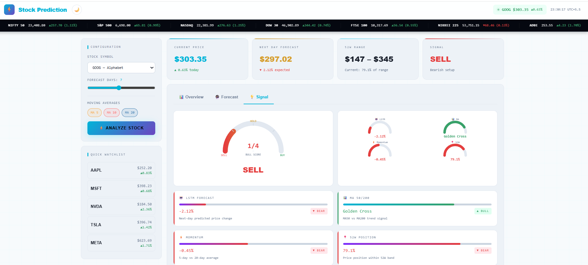

# 📊 Overview

**Stock Price Prediction**  A high performance, full-stack stock market analytics and predictive engine leveraging Deep Learning (LSTM) for time series forecasting to predict Stock prices.

---

# 🎯 Problem Statement

Stock prediction is difficult because of:

- High market volatility
- Noisy financial data
- Non-linear price movements
- Influence of global economic factors

Traditional statistical models struggle with these challenges.
Machine Learning models like **LSTM neural networks** can learn patterns in time-series data and improve prediction accuracy.

---

# 📸 Application Preview

<p align="center">
  
</p>

---

# 💡 Solution

QuantPulse implements a **complete AI-driven financial prediction pipeline**:

1. Collect historical market data  
2. Preprocess and normalize the data  
3. Generate technical indicators  
4. Train LSTM deep learning models  
5. Predict future stock prices  
6. Visualize predictions in an interactive dashboard  

---

# ✨ Key Features

🔥 **AI Price Prediction** using LSTM  
📊 **Interactive Candlestick Charts**  
⚡ **Real-Time Market Data Integration**  
📈 **Technical Indicator Analysis**  
📱 **Responsive Dashboard UI**  
🧠 **Multi-factor Signal Engine**

---

# 🏗 System Architecture

Market Data APIs

      ↓

Data Preprocessing

      ↓
Feature Engineering

      ↓
LSTM Prediction Model

      ↓
Prediction Engine

      ↓
Visualization Dashboard

---

# 🛠 Tech Stack

### Frontend
- React 18
- TypeScript
- TailwindCSS
- Motion Animations
- D3.js / Recharts

### Backend
- Node.js
- Express

### Machine Learning
- LSTM Neural Networks
- TensorFlow.js

---

# 📂 Project Structure

```

QuantPulse/
│
├── README.md
├── LICENSE
├── .gitignore
├── .env.example
├── Makefile
│
├── package.json
├── package-lock.json
├── tsconfig.json
├── pyproject.toml
│
├── index.html
├── server.ts
├── vite.config.ts
│
├── src/              # Application source code
├── configs/          # Configuration files
├── data/             # Dataset files
├── notebooks/        # Research notebooks
├── tests/            # Unit tests
├── logs/             # Runtime logs
└── docs/             # Documentation
└── DOCUMENTATION.md
```
---

# 📊 Dataset

Source: **Yahoo Finance API**

Features used:

| Feature | Description |
|------|-------------|
| Open | Opening price |
| High | Highest price |
| Low | Lowest price |
| Close | Final price |
| Volume | Total shares traded |

Dataset includes **2+ years of historical stock data**.

---

# ⚙ Data Preprocessing

Data preparation steps include:

- Handling missing values
- Feature scaling using **Min-Max normalization**
- Sliding window time-series generation
- Feature engineering (SMA, EMA, RSI)

---

# 🤖 Machine Learning Model

### LSTM (Long Short-Term Memory)

LSTM is designed for **time-series forecasting**.

Advantages:

- Learns long-term patterns
- Handles sequential financial data
- Performs well on stock market predictions

---

# 🧪 Model Training

Training strategy:

- **80% Training Data**
- **20% Testing Data**
- Optimizer: **Adam**
- Loss Function: **Mean Squared Error**

---

# 📈 Model Evaluation

Metrics used:

| Metric | Purpose |
|------|------|
| RMSE | Penalizes large errors |
| MAE | Average prediction error |
| Direction Accuracy | Predicts up/down movement |

---

# 🔮 Prediction Pipeline

1. User selects stock symbol  
2. Historical data is fetched  
3. Data is normalized  
4. Model predicts next price values  
5. Predictions are inverse scaled  
6. Results displayed in charts  

---

# 📊 Visualization

The dashboard displays:

📉 Candlestick charts  
📊 Volume indicators  
📈 Moving averages  
🔮 Future prediction overlay  

---

# ⚠ Challenges

- Market volatility
- Financial data noise
- Overfitting risk
- Unexpected global events

---

# 🚀 Future Improvements

- Financial news sentiment analysis
- Transformer-based prediction models
- Portfolio optimization tools
- Advanced risk analytics

---

# 🌍 Real World Applications

- Retail trading analytics
- FinTech platforms
- Financial education tools
- Market research systems

---

# 👨‍💻 Author

**Mr_Smb**

Software Developer | Vibe Coder

---

# ⭐ Support

If you like this project:

⭐ Star the repository  
🍴 Fork the project  
🚀 Contribute improvements  

---

# ⚠ Disclaimer

This project is for **educational purposes only**.  
Stock market predictions are **not financial advice**.
